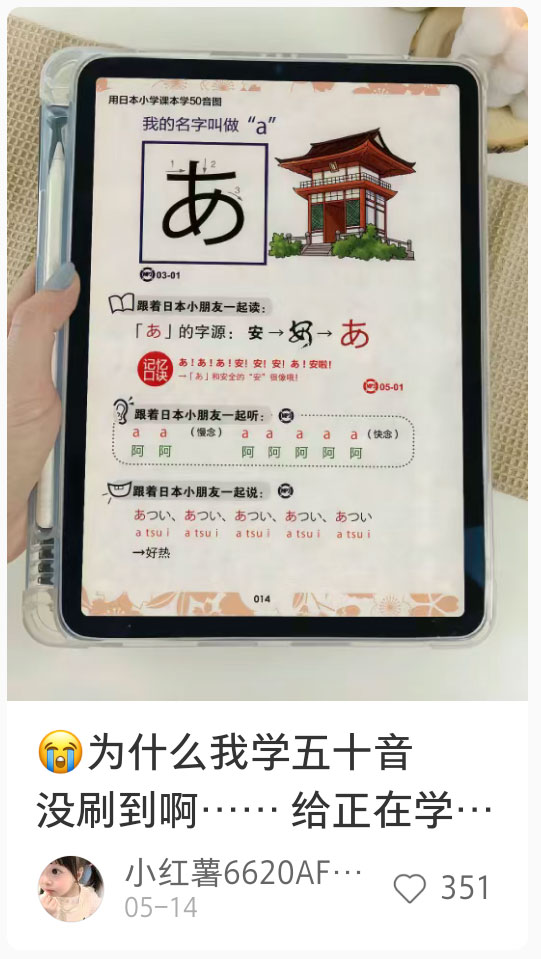
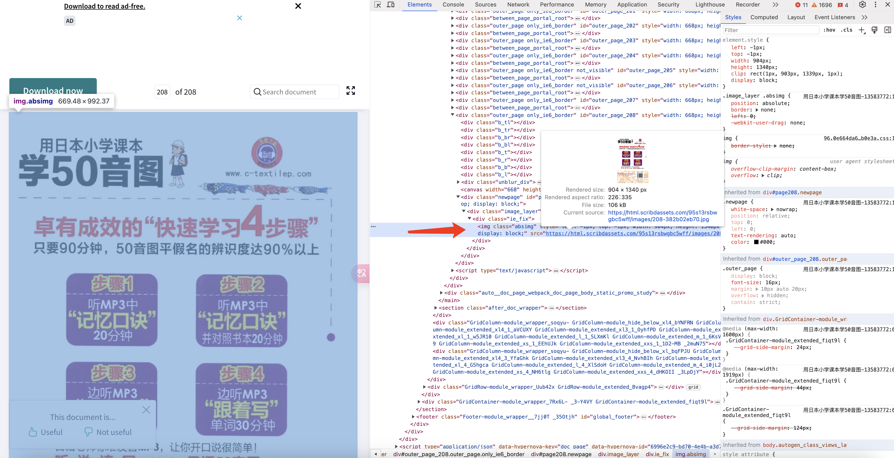
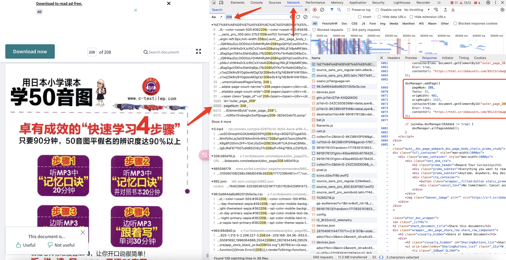
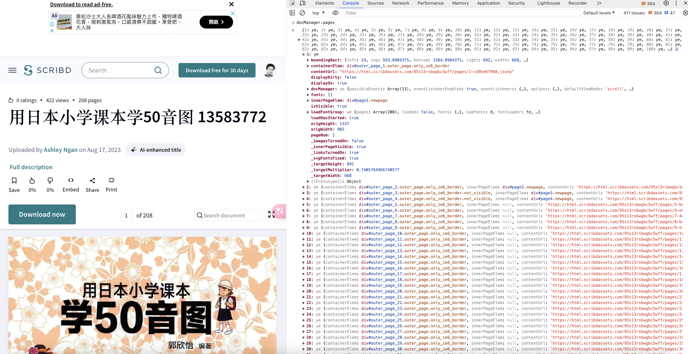
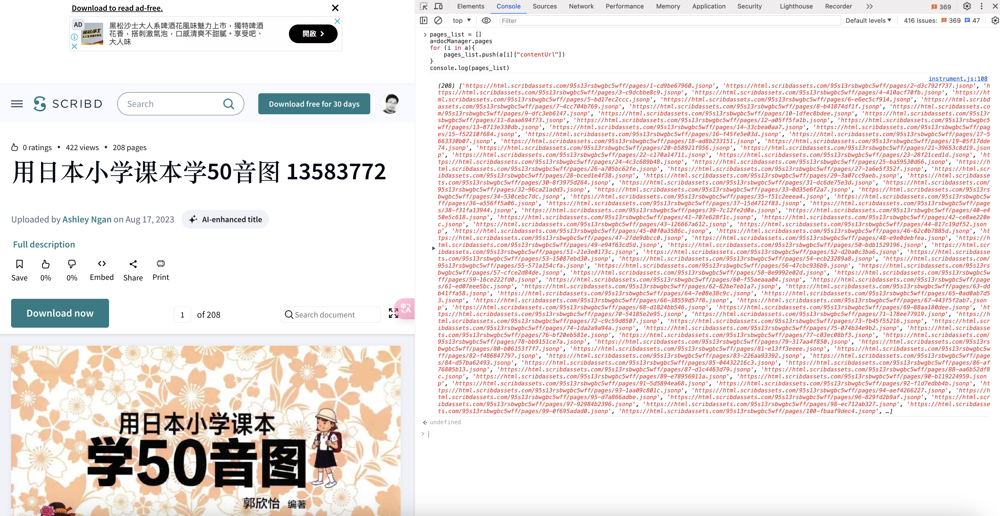

## 第一步：需求分析
正在学习日语，小红书上发现这个形式挺好的。



才知道书名后，全网搜《用日本小学课本学50音图》这个本电子书，zlibrary上下载的不是很清晰，希望能够下一本全的。

## 第二步：谷歌搜索资源
发现scribd.com上面有

[scribd.com 用日本小学课本学50音图](https://www.scribd.com/document/665598179/%E7%94%A8%E6%97%A5%E6%9C%AC%E5%B0%8F%E5%AD%A6%E8%AF%BE%E6%9C%AC%E5%AD%A650%E9%9F%B3%E5%9B%BE-13583772 "scribd.com 用日本小学课本学50音图")

## 第三步：准备下载

下载订阅费用，但是在线可以浏览


说实话这些年就没存什么钱，大学辍学后，一直自己干，每月挣的里面，现在加上老婆那份，每月上供国家6k+。


在线能浏览第一页


在线能浏览最后一页

## 第四步：开始破解
开始找DOM层位置



常规操作，直接右键审查元素，发现位置是图片，有链接。



通过network找图片地址里面的字符串，优先找了208，发现页面有渲染部分。

## 第五步：web控制台验证
```
docManager.pages
```


直接使用 docManager.pages 发现可以拿到列表

```
pages_list = []
a=docManager.pages
for (i in a){
    pages_list.push(a[i]["contentUrl"])
}

// 打印成果
console.log(pages_list)

// 为了后面爬取方便转字符串使用
console.log(JSON.stringify(pages_list))
```



脚本拿到链接地址。

```
// 脚本获取列表地址
https://html.scribdassets.com/95s13rsbwgbc5wff/pages/1-cd9be67960.jsonp

// 图片真实地址
https://html.scribdassets.com/95s13rsbwgbc5wff/images/1-cd9be67960.jpg
```

## 第六步：使用Python大法
```
import requests

from requests.adapters import HTTPAdapter
from requests.packages.urllib3.util.retry import Retry

book_name = "用日本小学课本学50音图"
image_list = ["https://html.scribdassets.com/95s13rsbwgbc5wff/pages/1-cd9be67960.jsonp","https://html.scribdassets.com/95s13rsbwgbc5wff/pages/2-d3c792f737.jsonp","https://html.scribdassets.com/95s13rsbwgbc5wff/pages/3-c9dcbbe8c9.jsonp","https://html.scribdassets.com/95s13rsbwgbc5wff/pages/4-410acf70fb.jsonp","https://html.scribdassets.com/95s13rsbwgbc5wff/pages/5-bd17ec2ccc.jsonp","https://html.scribdassets.com/95s13rsbwgbc5wff/pages/6-e6ec5cf914.jsonp","https://html.scribdassets.com/95s13rsbwgbc5wff/pages/7-4cc704b769.jsonp","https://html.scribdassets.com/95s13rsbwgbc5wff/pages/8-b41874df1f.jsonp","https://html.scribdassets.com/95s13rsbwgbc5wff/pages/9-dfc3eb6147.jsonp","https://html.scribdassets.com/95s13rsbwgbc5wff/pages/10-1dfec8bdee.jsonp","https://html.scribdassets.com/95s13rsbwgbc5wff/pages/11-8aaa694f73.jsonp","https://html.scribdassets.com/95s13rsbwgbc5wff/pages/12-a05ff5fa1b.jsonp","https://html.scribdassets.com/95s13rsbwgbc5wff/pages/13-8713e330db.jsonp","https://html.scribdassets.com/95s13rsbwgbc5wff/pages/14-33cbea0aa7.jsonp","https://html.scribdassets.com/95s13rsbwgbc5wff/pages/15-f52210f684.jsonp","https://html.scribdassets.com/95s13rsbwgbc5wff/pages/16-f45fe5e03d.jsonp","https://html.scribdassets.com/95s13rsbwgbc5wff/pages/17-5663330b07.jsonp","https://html.scribdassets.com/95s13rsbwgbc5wff/pages/18-ad8b233151.jsonp","https://html.scribdassets.com/95s13rsbwgbc5wff/pages/19-05f17dde74.jsonp","https://html.scribdassets.com/95s13rsbwgbc5wff/pages/20-b58921f956.jsonp","https://html.scribdassets.com/95s13rsbwgbc5wff/pages/21-39653c8d19.jsonp","https://html.scribdassets.com/95s13rsbwgbc5wff/pages/22-c170a14711.jsonp","https://html.scribdassets.com/95s13rsbwgbc5wff/pages/23-28f21ced1d.jsonp","https://html.scribdassets.com/95s13rsbwgbc5wff/pages/24-4c3c689b48.jsonp","https://html.scribdassets.com/95s13rsbwgbc5wff/pages/25-ba59530d66.jsonp","https://html.scribdassets.com/95s13rsbwgbc5wff/pages/26-a705bc62fe.jsonp","https://html.scribdassets.com/95s13rsbwgbc5wff/pages/27-1a6e5f352f.jsonp","https://html.scribdassets.com/95s13rsbwgbc5wff/pages/28-bced1e4f38.jsonp","https://html.scribdassets.com/95s13rsbwgbc5wff/pages/29-3a07cc9aeb.jsonp","https://html.scribdassets.com/95s13rsbwgbc5wff/pages/30-8f3975d264.jsonp","https://html.scribdassets.com/95s13rsbwgbc5wff/pages/31-dc6de75e3d.jsonp","https://html.scribdassets.com/95s13rsbwgbc5wff/pages/32-96ca21add3.jsonp","https://html.scribdassets.com/95s13rsbwgbc5wff/pages/33-0d35e6f2a7.jsonp","https://html.scribdassets.com/95s13rsbwgbc5wff/pages/34-530cebc7dc.jsonp","https://html.scribdassets.com/95s13rsbwgbc5wff/pages/35-f51c2eeea4.jsonp","https://html.scribdassets.com/95s13rsbwgbc5wff/pages/36-a556ff5a06.jsonp","https://html.scribdassets.com/95s13rsbwgbc5wff/pages/37-15d4712f83.jsonp","https://html.scribdassets.com/95s13rsbwgbc5wff/pages/38-f31fa13944.jsonp","https://html.scribdassets.com/95s13rsbwgbc5wff/pages/39-7c12fe2d0a.jsonp","https://html.scribdassets.com/95s13rsbwgbc5wff/pages/40-e450e5c618.jsonp","https://html.scribdassets.com/95s13rsbwgbc5wff/pages/41-707e628f1c.jsonp","https://html.scribdassets.com/95s13rsbwgbc5wff/pages/42-ce8ae220ec.jsonp","https://html.scribdassets.com/95s13rsbwgbc5wff/pages/43-126667a612.jsonp","https://html.scribdassets.com/95s13rsbwgbc5wff/pages/44-817c19df52.jsonp","https://html.scribdassets.com/95s13rsbwgbc5wff/pages/45-00f0a3586c.jsonp","https://html.scribdassets.com/95s13rsbwgbc5wff/pages/46-62c0b7885d.jsonp","https://html.scribdassets.com/95s13rsbwgbc5wff/pages/47-27de9dbcc0.jsonp","https://html.scribdassets.com/95s13rsbwgbc5wff/pages/48-e9e0debfea.jsonp","https://html.scribdassets.com/95s13rsbwgbc5wff/pages/49-e94f63cd5d.jsonp","https://html.scribdassets.com/95s13rsbwgbc5wff/pages/50-bdb1529196.jsonp","https://html.scribdassets.com/95s13rsbwgbc5wff/pages/51-21e3e0173c.jsonp","https://html.scribdassets.com/95s13rsbwgbc5wff/pages/52-d2ba0c3ba6.jsonp","https://html.scribdassets.com/95s13rsbwgbc5wff/pages/53-15087ebd30.jsonp","https://html.scribdassets.com/95s13rsbwgbc5wff/pages/54-ecb23289a8.jsonp","https://html.scribdassets.com/95s13rsbwgbc5wff/pages/55-571a154cfa.jsonp","https://html.scribdassets.com/95s13rsbwgbc5wff/pages/56-47cbc936b9.jsonp","https://html.scribdassets.com/95s13rsbwgbc5wff/pages/57-cfce2d84de.jsonp","https://html.scribdassets.com/95s13rsbwgbc5wff/pages/58-8e9992e02d.jsonp","https://html.scribdassets.com/95s13rsbwgbc5wff/pages/59-16ce222fd0.jsonp","https://html.scribdassets.com/95s13rsbwgbc5wff/pages/60-f55aeaaa04.jsonp","https://html.scribdassets.com/95s13rsbwgbc5wff/pages/61-ed07eee5bc.jsonp","https://html.scribdassets.com/95s13rsbwgbc5wff/pages/62-82be7eb1a7.jsonp","https://html.scribdassets.com/95s13rsbwgbc5wff/pages/63-ddb41ffa58.jsonp","https://html.scribdassets.com/95s13rsbwgbc5wff/pages/64-7e08e38c9c.jsonp","https://html.scribdassets.com/95s13rsbwgbc5wff/pages/65-0ad0ab7d53.jsonp","https://html.scribdassets.com/95s13rsbwgbc5wff/pages/66-38559d57f8.jsonp","https://html.scribdassets.com/95s13rsbwgbc5wff/pages/67-443f5f2ab7.jsonp","https://html.scribdassets.com/95s13rsbwgbc5wff/pages/68-d1824bb546.jsonp","https://html.scribdassets.com/95s13rsbwgbc5wff/pages/69-88aa180dee.jsonp","https://html.scribdassets.com/95s13rsbwgbc5wff/pages/70-54185e2e95.jsonp","https://html.scribdassets.com/95s13rsbwgbc5wff/pages/71-178ee77919.jsonp","https://html.scribdassets.com/95s13rsbwgbc5wff/pages/72-c9c59d8507.jsonp","https://html.scribdassets.com/95s13rsbwgbc5wff/pages/73-fb45f55216.jsonp","https://html.scribdassets.com/95s13rsbwgbc5wff/pages/74-1da2a9a94a.jsonp","https://html.scribdassets.com/95s13rsbwgbc5wff/pages/75-074b34e9b2.jsonp","https://html.scribdassets.com/95s13rsbwgbc5wff/pages/76-bf20eb581e.jsonp","https://html.scribdassets.com/95s13rsbwgbc5wff/pages/77-c03ec08bf3.jsonp","https://html.scribdassets.com/95s13rsbwgbc5wff/pages/78-bb9151ce7a.jsonp","https://html.scribdassets.com/95s13rsbwgbc5wff/pages/79-317aa4f850.jsonp","https://html.scribdassets.com/95s13rsbwgbc5wff/pages/80-b06153f7f7.jsonp","https://html.scribdassets.com/95s13rsbwgbc5wff/pages/81-e13ff3eeee.jsonp","https://html.scribdassets.com/95s13rsbwgbc5wff/pages/82-f486847797.jsonp","https://html.scribdassets.com/95s13rsbwgbc5wff/pages/83-226aa93392.jsonp","https://html.scribdassets.com/95s13rsbwgbc5wff/pages/84-d57ba62493.jsonp","https://html.scribdassets.com/95s13rsbwgbc5wff/pages/85-04432216c3.jsonp","https://html.scribdassets.com/95s13rsbwgbc5wff/pages/86-af76805b13.jsonp","https://html.scribdassets.com/95s13rsbwgbc5wff/pages/87-d1c4463d79.jsonp","https://html.scribdassets.com/95s13rsbwgbc5wff/pages/88-aa6b52df8c.jsonp","https://html.scribdassets.com/95s13rsbwgbc5wff/pages/89-e78956911a.jsonp","https://html.scribdassets.com/95s13rsbwgbc5wff/pages/90-b119224959.jsonp","https://html.scribdassets.com/95s13rsbwgbc5wff/pages/91-5d5894ea68.jsonp","https://html.scribdassets.com/95s13rsbwgbc5wff/pages/92-f1d7edbb4b.jsonp","https://html.scribdassets.com/95s13rsbwgbc5wff/pages/93-1aa09c801c.jsonp","https://html.scribdassets.com/95s13rsbwgbc5wff/pages/94-aef4266227.jsonp","https://html.scribdassets.com/95s13rsbwgbc5wff/pages/95-d7a866adbe.jsonp","https://html.scribdassets.com/95s13rsbwgbc5wff/pages/96-829fd2b9af.jsonp","https://html.scribdassets.com/95s13rsbwgbc5wff/pages/97-92984b2396.jsonp","https://html.scribdassets.com/95s13rsbwgbc5wff/pages/98-ec712ab327.jsonp","https://html.scribdassets.com/95s13rsbwgbc5wff/pages/99-0f695adad0.jsonp","https://html.scribdassets.com/95s13rsbwgbc5wff/pages/100-fbaaf9dec4.jsonp","https://html.scribdassets.com/95s13rsbwgbc5wff/pages/101-8e2c24c364.jsonp","https://html.scribdassets.com/95s13rsbwgbc5wff/pages/102-71c60e43ae.jsonp","https://html.scribdassets.com/95s13rsbwgbc5wff/pages/103-028c8b6d35.jsonp","https://html.scribdassets.com/95s13rsbwgbc5wff/pages/104-934337a09c.jsonp","https://html.scribdassets.com/95s13rsbwgbc5wff/pages/105-044118c201.jsonp","https://html.scribdassets.com/95s13rsbwgbc5wff/pages/106-d0284ed43a.jsonp","https://html.scribdassets.com/95s13rsbwgbc5wff/pages/107-c4bdaa1cfc.jsonp","https://html.scribdassets.com/95s13rsbwgbc5wff/pages/108-84dd6f1fc0.jsonp","https://html.scribdassets.com/95s13rsbwgbc5wff/pages/109-a4c10c7685.jsonp","https://html.scribdassets.com/95s13rsbwgbc5wff/pages/110-051af0b249.jsonp","https://html.scribdassets.com/95s13rsbwgbc5wff/pages/111-e06e510e7a.jsonp","https://html.scribdassets.com/95s13rsbwgbc5wff/pages/112-8a817706e4.jsonp","https://html.scribdassets.com/95s13rsbwgbc5wff/pages/113-4c23d82abb.jsonp","https://html.scribdassets.com/95s13rsbwgbc5wff/pages/114-1778cb9941.jsonp","https://html.scribdassets.com/95s13rsbwgbc5wff/pages/115-e0b327f773.jsonp","https://html.scribdassets.com/95s13rsbwgbc5wff/pages/116-214f539ee6.jsonp","https://html.scribdassets.com/95s13rsbwgbc5wff/pages/117-19e6799cf5.jsonp","https://html.scribdassets.com/95s13rsbwgbc5wff/pages/118-151857c2e3.jsonp","https://html.scribdassets.com/95s13rsbwgbc5wff/pages/119-68e0f0075e.jsonp","https://html.scribdassets.com/95s13rsbwgbc5wff/pages/120-501ce679f2.jsonp","https://html.scribdassets.com/95s13rsbwgbc5wff/pages/121-7188f22bb8.jsonp","https://html.scribdassets.com/95s13rsbwgbc5wff/pages/122-b730fbf4b2.jsonp","https://html.scribdassets.com/95s13rsbwgbc5wff/pages/123-8bc180918b.jsonp","https://html.scribdassets.com/95s13rsbwgbc5wff/pages/124-9c437b5c0b.jsonp","https://html.scribdassets.com/95s13rsbwgbc5wff/pages/125-3ab7f712d9.jsonp","https://html.scribdassets.com/95s13rsbwgbc5wff/pages/126-6fa2ed290c.jsonp","https://html.scribdassets.com/95s13rsbwgbc5wff/pages/127-e8b58c0574.jsonp","https://html.scribdassets.com/95s13rsbwgbc5wff/pages/128-a67460bbf7.jsonp","https://html.scribdassets.com/95s13rsbwgbc5wff/pages/129-ad4843d706.jsonp","https://html.scribdassets.com/95s13rsbwgbc5wff/pages/130-4f39ed2a0d.jsonp","https://html.scribdassets.com/95s13rsbwgbc5wff/pages/131-b61bbc267f.jsonp","https://html.scribdassets.com/95s13rsbwgbc5wff/pages/132-20f7406d63.jsonp","https://html.scribdassets.com/95s13rsbwgbc5wff/pages/133-2a3353a482.jsonp","https://html.scribdassets.com/95s13rsbwgbc5wff/pages/134-a325b35209.jsonp","https://html.scribdassets.com/95s13rsbwgbc5wff/pages/135-05065f050e.jsonp","https://html.scribdassets.com/95s13rsbwgbc5wff/pages/136-4c8be5bed3.jsonp","https://html.scribdassets.com/95s13rsbwgbc5wff/pages/137-aff649944b.jsonp","https://html.scribdassets.com/95s13rsbwgbc5wff/pages/138-d614e14e01.jsonp","https://html.scribdassets.com/95s13rsbwgbc5wff/pages/139-a23a0efd88.jsonp","https://html.scribdassets.com/95s13rsbwgbc5wff/pages/140-213d30e573.jsonp","https://html.scribdassets.com/95s13rsbwgbc5wff/pages/141-cda70686cb.jsonp","https://html.scribdassets.com/95s13rsbwgbc5wff/pages/142-6eb114ccd2.jsonp","https://html.scribdassets.com/95s13rsbwgbc5wff/pages/143-6ecf5e6d05.jsonp","https://html.scribdassets.com/95s13rsbwgbc5wff/pages/144-75b65dbf06.jsonp","https://html.scribdassets.com/95s13rsbwgbc5wff/pages/145-5d54544244.jsonp","https://html.scribdassets.com/95s13rsbwgbc5wff/pages/146-7c991158ae.jsonp","https://html.scribdassets.com/95s13rsbwgbc5wff/pages/147-db8eccbe12.jsonp","https://html.scribdassets.com/95s13rsbwgbc5wff/pages/148-641a28eedf.jsonp","https://html.scribdassets.com/95s13rsbwgbc5wff/pages/149-020f1f73b2.jsonp","https://html.scribdassets.com/95s13rsbwgbc5wff/pages/150-42a3b81918.jsonp","https://html.scribdassets.com/95s13rsbwgbc5wff/pages/151-52a68584e8.jsonp","https://html.scribdassets.com/95s13rsbwgbc5wff/pages/152-524e2c64a5.jsonp","https://html.scribdassets.com/95s13rsbwgbc5wff/pages/153-1d26594f5b.jsonp","https://html.scribdassets.com/95s13rsbwgbc5wff/pages/154-c218ced7f0.jsonp","https://html.scribdassets.com/95s13rsbwgbc5wff/pages/155-a83dfbfff6.jsonp","https://html.scribdassets.com/95s13rsbwgbc5wff/pages/156-428c56ff5e.jsonp","https://html.scribdassets.com/95s13rsbwgbc5wff/pages/157-89fbda2bbf.jsonp","https://html.scribdassets.com/95s13rsbwgbc5wff/pages/158-cb81781a33.jsonp","https://html.scribdassets.com/95s13rsbwgbc5wff/pages/159-e6c73869bf.jsonp","https://html.scribdassets.com/95s13rsbwgbc5wff/pages/160-dbbb17b632.jsonp","https://html.scribdassets.com/95s13rsbwgbc5wff/pages/161-f52adc30f9.jsonp","https://html.scribdassets.com/95s13rsbwgbc5wff/pages/162-cd8d023b0d.jsonp","https://html.scribdassets.com/95s13rsbwgbc5wff/pages/163-d45a23357f.jsonp","https://html.scribdassets.com/95s13rsbwgbc5wff/pages/164-14f292d170.jsonp","https://html.scribdassets.com/95s13rsbwgbc5wff/pages/165-ad9ea92dbd.jsonp","https://html.scribdassets.com/95s13rsbwgbc5wff/pages/166-e83f7f2751.jsonp","https://html.scribdassets.com/95s13rsbwgbc5wff/pages/167-cd74fd7bd2.jsonp","https://html.scribdassets.com/95s13rsbwgbc5wff/pages/168-214ea00b3a.jsonp","https://html.scribdassets.com/95s13rsbwgbc5wff/pages/169-23ea01e000.jsonp","https://html.scribdassets.com/95s13rsbwgbc5wff/pages/170-6da06be639.jsonp","https://html.scribdassets.com/95s13rsbwgbc5wff/pages/171-09aeb80071.jsonp","https://html.scribdassets.com/95s13rsbwgbc5wff/pages/172-75354e31ce.jsonp","https://html.scribdassets.com/95s13rsbwgbc5wff/pages/173-52a394e1d0.jsonp","https://html.scribdassets.com/95s13rsbwgbc5wff/pages/174-f22cd5c170.jsonp","https://html.scribdassets.com/95s13rsbwgbc5wff/pages/175-dfda846fa6.jsonp","https://html.scribdassets.com/95s13rsbwgbc5wff/pages/176-f1662e630c.jsonp","https://html.scribdassets.com/95s13rsbwgbc5wff/pages/177-bd9095fc3f.jsonp","https://html.scribdassets.com/95s13rsbwgbc5wff/pages/178-8200eaa3ba.jsonp","https://html.scribdassets.com/95s13rsbwgbc5wff/pages/179-dadf5a9438.jsonp","https://html.scribdassets.com/95s13rsbwgbc5wff/pages/180-fd8488c19d.jsonp","https://html.scribdassets.com/95s13rsbwgbc5wff/pages/181-9a1a3c8dd8.jsonp","https://html.scribdassets.com/95s13rsbwgbc5wff/pages/182-88fd1faf5b.jsonp","https://html.scribdassets.com/95s13rsbwgbc5wff/pages/183-71c09f412f.jsonp","https://html.scribdassets.com/95s13rsbwgbc5wff/pages/184-0cee834680.jsonp","https://html.scribdassets.com/95s13rsbwgbc5wff/pages/185-61f6861ee4.jsonp","https://html.scribdassets.com/95s13rsbwgbc5wff/pages/186-41b7a0d8d2.jsonp","https://html.scribdassets.com/95s13rsbwgbc5wff/pages/187-02b2040879.jsonp","https://html.scribdassets.com/95s13rsbwgbc5wff/pages/188-73ffb062db.jsonp","https://html.scribdassets.com/95s13rsbwgbc5wff/pages/189-c1a93b0881.jsonp","https://html.scribdassets.com/95s13rsbwgbc5wff/pages/190-48600766aa.jsonp","https://html.scribdassets.com/95s13rsbwgbc5wff/pages/191-0e12e1b3a8.jsonp","https://html.scribdassets.com/95s13rsbwgbc5wff/pages/192-f2bd91278f.jsonp","https://html.scribdassets.com/95s13rsbwgbc5wff/pages/193-f9c81742f4.jsonp","https://html.scribdassets.com/95s13rsbwgbc5wff/pages/194-f0b0576f5c.jsonp","https://html.scribdassets.com/95s13rsbwgbc5wff/pages/195-75272c009c.jsonp","https://html.scribdassets.com/95s13rsbwgbc5wff/pages/196-55cf545d42.jsonp","https://html.scribdassets.com/95s13rsbwgbc5wff/pages/197-7190d63e8a.jsonp","https://html.scribdassets.com/95s13rsbwgbc5wff/pages/198-c04c52c6af.jsonp","https://html.scribdassets.com/95s13rsbwgbc5wff/pages/199-6424e78feb.jsonp","https://html.scribdassets.com/95s13rsbwgbc5wff/pages/200-309087f3f3.jsonp","https://html.scribdassets.com/95s13rsbwgbc5wff/pages/201-f425a24951.jsonp","https://html.scribdassets.com/95s13rsbwgbc5wff/pages/202-c23a0f9721.jsonp","https://html.scribdassets.com/95s13rsbwgbc5wff/pages/203-c7e8204317.jsonp","https://html.scribdassets.com/95s13rsbwgbc5wff/pages/204-8554fd6ef6.jsonp","https://html.scribdassets.com/95s13rsbwgbc5wff/pages/205-723e440215.jsonp","https://html.scribdassets.com/95s13rsbwgbc5wff/pages/206-dfa24bb931.jsonp","https://html.scribdassets.com/95s13rsbwgbc5wff/pages/207-f93c21b1d7.jsonp","https://html.scribdassets.com/95s13rsbwgbc5wff/pages/208-382b02eb70.jsonp"]
image_num = 0

headers = {
    'User-Agent': 'Mozilla/5.0 (Windows NT 10.0; Win64; x64) AppleWebKit/537.36 (KHTML, like Gecko) Chrome/58.0.3029.110 Safari/537.36'
}


for image_item in image_list:
    image_url = image_item.replace("pages","images")
    image_url = image_url.replace("jsonp","jpg")
    print(image_url)

    url = image_url
    session = requests.Session()
    retries = Retry(total=5, backoff_factor=1, status_forcelist=[502, 503, 504])
    session.mount('https://', HTTPAdapter(max_retries=retries))

    try:
        response = session.get(url, headers=headers,timeout=5)
        print(response)
        response.raise_for_status()
        # Process your response here
        # 获取的文本实际上是图片的二进制文本
        img = response.content
        # 将他拷贝到本地文件 w 写  b 二进制  wb代表写入二进制文本
        #保存路径
        file_name_path="%s/%s.jpg"%(book_name,image_num)
        with open(file_name_path, 'wb') as f:
            f.write(img)
    except requests.exceptions.Timeout:
        print("The request timed out")
    except requests.exceptions.RequestException as e:
        print(f"An error occurred: {e}")

    image_num+=1

```

本地执行遇到了连不上对方服务器的囧境，国内工程师大写尴尬。这段代码直接去google的colab。
下载完记得执行打包代码
```
!zip -r "用日本小学课本学50音图.zip" "用日本小学课本学50音图"
```
[colab代码传送门](https://colab.research.google.com/drive/1uzzR1MhaSsF7-qZL539XS2tjgiHfXG8b?usp=sharing "colab代码传送门")

## 注意事项
1、PDF存在排版问题，特别是图片模式。
2、当前仅解析全图片模式，请周知。
