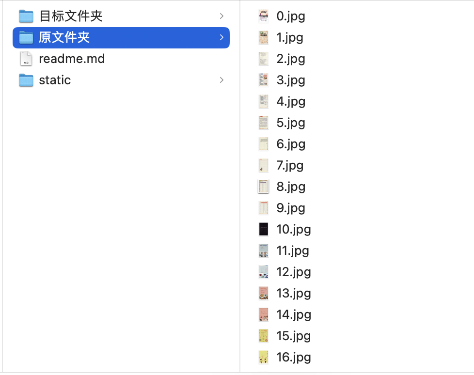
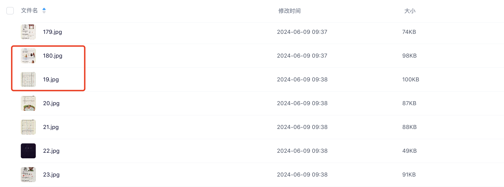

## 第一步：需求分析


下载时用的自增变量，mac的表现很好，就是顺序的。但是上传百度网盘后，他们的文件列表sort排序，会有问题。




## 第二步：解决方式
为了解决这个问题，所以不能用文件名的自增模式列，要补齐。

举例：

原模式：1, 2, 3, 4, 5, 6, 7, ... 98, 99, 100, 101, ...

目标模式：001, 002, 003, 004, 005, 006, ... 098, 099, 100, 101, ...

## 第三部：Python大法
```
import os
import shutil

base_folder = "原文件夹"
aim_folder = "目标文件夹"

# 获取文件夹下所有文件和文件夹名称
base_filenames = os.listdir(base_folder)
 
# 打印所有文件名
for base_filename in base_filenames:
    [name,file_type] = base_filename.split(".")
    name_int = int(name)
    aim_name = "%03d"%name_int
    print(name,file_type,"=>",aim_name,file_type)
    new_aim_filename = "%s.%s"%(aim_name,file_type)

    source_path = "%s/%s"%(base_folder,base_filename)
    target_path = "%s/%s"%(aim_folder,base_filename)
    new_aim_filename = "%s/%s"%(aim_folder,new_aim_filename)

    shutil.copy(source_path, target_path)
    os.rename(target_path, new_aim_filename)

```


