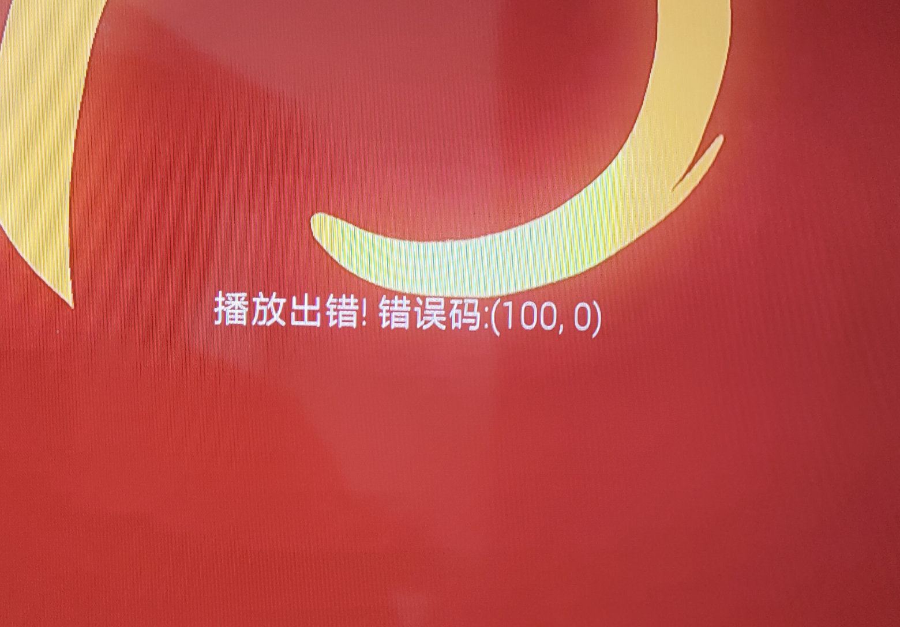

## 第一步：需求分析




好不容易下了很久的视频，竟然播不了，见了鬼了……

家里一台小米电视4A，还在坚持用，卡是卡得跟狗一样。

## 第二步：上ffmpeg，不就是转码么

```
ffmpeg_command = [
        'ffmpeg',  # 调用ffmpeg程序
        '-hwaccel','videotoolbox',
        # '-thread_queue_size', '1024',
        '-i', input_file,  # 输入文件
        '-c:v', 'libx264',  # 使用libx264编解码器
        '-crf', '26',
        '-preset', 'ultrafast',  # 编码速度和质量的平衡，slow表示质量更好
        '-c:a', 'aac',
        '-vf', 'scale=1920:1080',
        # '-vf', 'scale=1280:720',
        # '-b:a', '128k',
        output_file  # 输出文件
        # '-hide_banner'
    ]
```

## 汇总意见
小米电视，最好全是mp4的文件能解，部分rmkv、mkv、avi，都会出现解码问题。

## 额外
发现视频导出时，画面有问题，发现是原始的问题。

1、ffmpeg剥离音频
```
ffmpeg -i input.mkv -c copy -map 0:a output_audio.mp3
```


